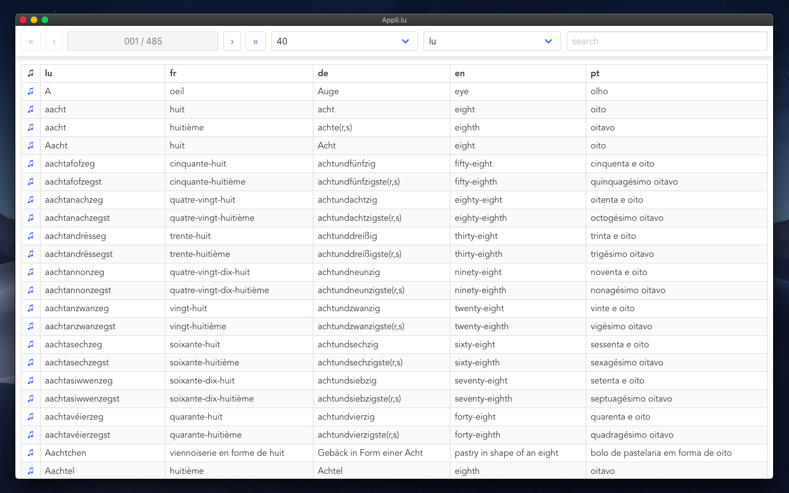
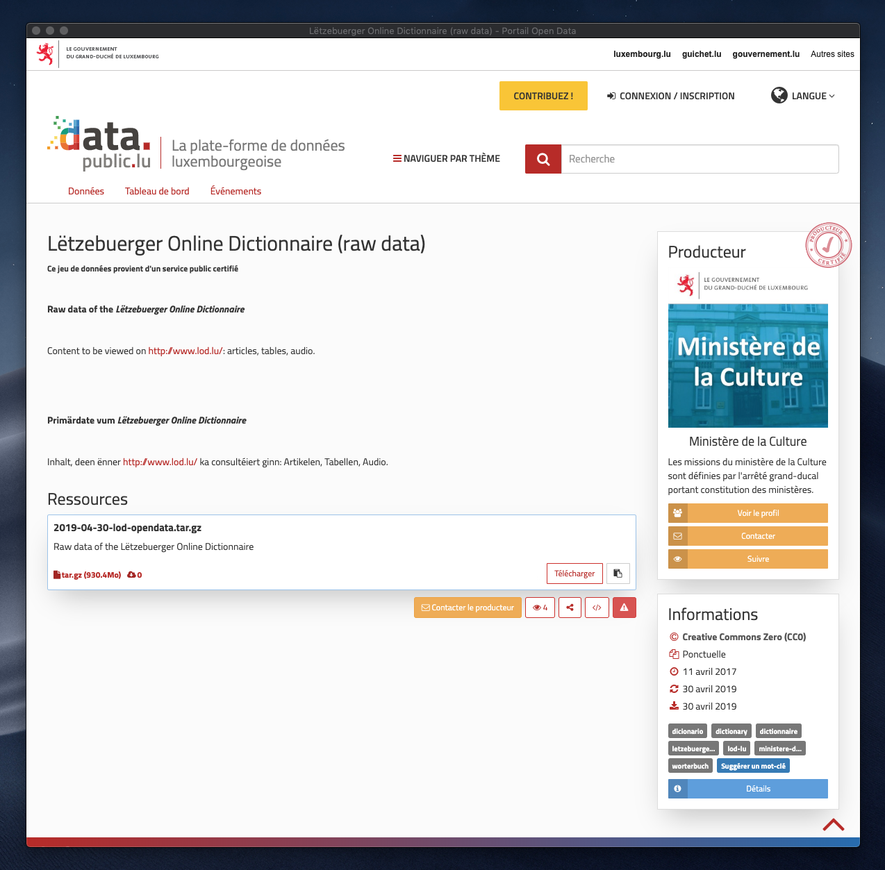

# appli.lu

A pretty simple Vue PWA for playing with the data of the Lëtzebuerger Online Dictionnaire (LOD).

Author : [Roberto Entringer](https://robertoentringer.com)  
License: MIT  
Website : https://appli.lu  

# Data source

Data from the "Lëtzebuerger Online Dictionnaire" (LOD)  
Website: http://www.lod.lu  
Source: https://data.public.lu/fr/datasets/letzebuerger-online-dictionnaire-raw-data/  
Licence: Creative Commons Zero (CC0) 

